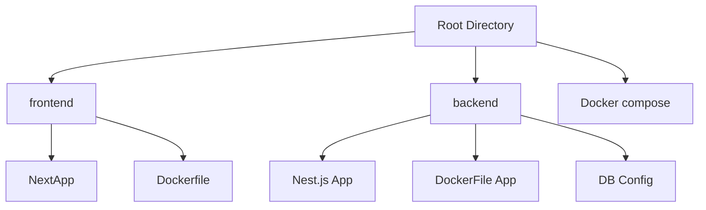

# Upload-Image-to-S3-bucket-Next-Nest

The project is organized as a monorepo containing a **frontend** built with Next.js and a **backend** built with NestJS.

## Folder Structure



### Frontend

The **frontend** is a standard Next.js application with the following main folders:

- **`app/`**: Contains the application routes and components, leveraging the new App Directory feature in Next.js.
- **`public/`**: Stores static assets like images, icons, and other resources.
- **`components/`**: Reusable React components that are used across various parts of the application.

### Backend

The **backend** is a standard NestJS application with the following main folders under `src/`:

- **`features/`**: Contains individual feature modules, each module encapsulates its related controllers, services, and entities.
- **`services/`**: Houses shared services that can be used across multiple features.
- **`controllers/`**: Contains the main controllers for handling HTTP requests.
- **`entities/`**: Represents the data models used in TypeORM for interacting with the database.

## Installation

This project uses Docker to simplify the setup process. Follow the steps below to get started:

1. **Clone the repository**:

   ```bash
   git clone <RepoName>
   cd <RepoName>
   ```

2. **Create the necessary `.env` files** for the frontend and backend. Refer to `.env.example` files provided in each folder. You will only need to add variables for AWS.

3. **Build and start the Docker containers**:

   This has to do to a problem with my Dockerfile in the frontend. I could not solve it so the workarround is to build locally and then run docker compose.

   ```bash
   cd frontend
   npm install
   npm run build
   cd ..
   ```

   ```bash
   docker-compose up --build
   ```

4. **Access the applications**:

   - The **frontend** will be available at [http://localhost:3001](http://localhost:3001).
   - The **backend** will be available at [http://localhost:9000](http://localhost:9000).
   - The **database** will be available at [http://localhost:3012](http://localhost:3012).

5. **Verify the Setup**:

   Go to to the forontend [localhost:3001](http://localhost:3001) and check if the app is up.

## Additional Notes

- Make sure Docker is installed and running on your system before starting the setup.
- If any issues arise, check the container logs using:

  ```bash
  docker-compose logs
  ```
